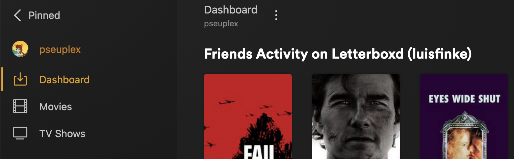
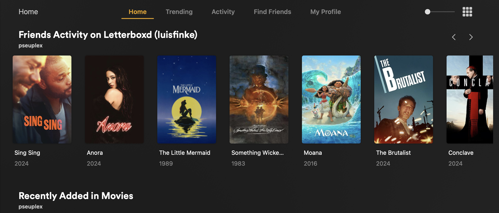
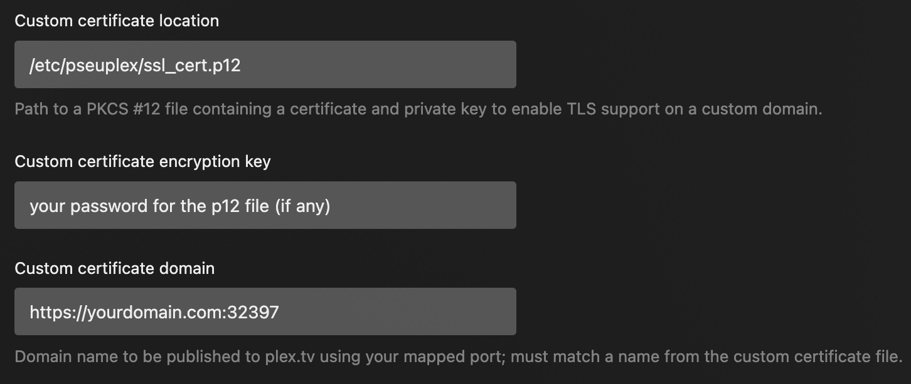
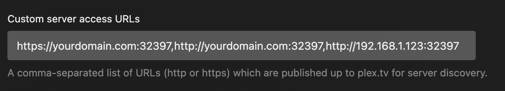
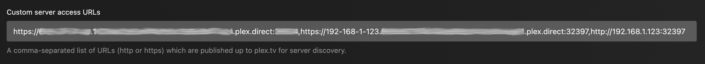
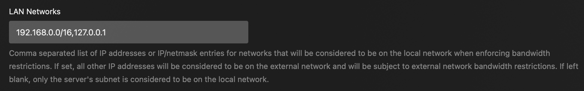

# Pseudo Metadata Proxy for Plex

A middleware proxy for the plex server API. This sits in between the plex client and the plex server, forwarding requests and modifying responses to add some extra features.

Inspired by [Replex](https://github.com/lostb1t/replex)

This project is still very much a WIP. While I've tried to do my due diligence in terms of security ([middleware](src/plex/requesthandling.ts#L81) prevents unauthorized requests from tokens not listed in the shared account list), I'm really the only contributor right now. Use at your own risk.

## Features

- ### Customizable "Dashboard" Section

	A fake "dashboard" section can be shown with customizable hubs, such as your friends activity on letterboxd. This allows you to extend the typical recommended movies and shows you see on your homepage.

	

	A list of hubs that can be configured is available [here](docs/Dashboard.md#hubs).

	For movies that aren't available on your server, the "unavailable" status will appear on the details page.

	

- ### Similar Films on Letterboxd

	Instead of only showing related movies from your server, you can show the list of similar movies from letterboxd

	

- ### Letterboxd Friends Activity

	Activity from your letterboxd friends can be displayed on the server home page. Different users on your server can be configured to display their own friend feeds.

	

- ### Letterboxd Friends Reviews

	Reviews from your letterboxd friends can be included alongside the RottenTomatoes reviews

	**NOTE: In the newer mobile apps, Plex now fetches critics reviews from plex.tv instead of from your server, so this feature sadly no longer works for those apps. It's unclear if this is intentional or a mistake, but hopefully they will decide to fix this.**

	

## Contributing

This app is structured to have different ["plugins"](src/plugins) to provide different functionality. The [template](src/plugins/template) plugin is provided to give a starting point for anyone implementing a new plugin. At the moment, these are only defined [in this project](src/main.ts#L156) and not externally loaded, but this may change in the future if there's an interest in it. If you would like to add your own set of functionality unrelated to letterboxd or any existing functionality, you should create your own "plugin".

Feel free to ask me if you're unsure of where to implement something!

## Setup

### SSL

You will need to use your own SSL certificate for your plex server in order for this proxy to modify requests over HTTPS. Otherwise, it will only work over HTTP, or it will fallback to the plex server's true address instead of the proxy address.

### Configuration

Create a `config.json` file with the following structure, and fill in the configuration for your setup:

```json
{
	"port": 32397,
	"plex": {
		"host": "http://127.0.0.1:32400",
		"token": "<PLEX API TOKEN>"
	},
	"ssl": {
		"keyPath": "/etc/pseudo_plex_proxy/ssl_cert.key",
		"certPath": "/etc/pseudo_plex_proxy/ssl_cert.crt"
	},
	"dashboard": {
		"enabled": true,
	},
	"perUser": {
		"yourplexuseremail@example.com": {
			"letterboxd": {
				"username": "<LETTERBOXD USERNAME>"
			},
			"dashboard": {
				"hubs": [
					{
						"plugin": "letterboxd",
						"hub": "userFollowingActivity",
						"arg": "<LETTERBOXD USERNAME>"
					}
				]
			}
		}
	}
}
```

- **protocol**: The server protocol. Either `http`, `https`, or `http+https` (default is `http+https`)
- **port**: The port that this proxy will run on.
- **plex**
	- **host**: The url of your plex server.
	- **token**: The plex API token of the server owner.
	- **appDataPath**: (*optional*) Manually specify the path of your plex server's appdata folder if it's in an unconventional place. On Linux, this is typically `/var/lib/plexmediaserver/Library/Application Support/Plex Media Server` unless you're running via docker. This will be used to determine the path of the SSL certificate if `ssl.autoP12Path` is `true`. This will also be used to determine the path of `Preferences.xml` if `ssl.autoP12Password` is `true`.
	- **assumedTopSectionId**: (*optional*) Because of a bug in Plex for Mobile, it isn't possible to determine which section is the first "pinned" section. To fix this, you can manually specify the top pinned section ID here.
- **ssl**
	- **p12Path**: The path to your SSL p12 file.
	- **p12Password**: The password to decrypt your SSL p12 file.
	- **keyPath**: The path to your SSL private key. This is ignored if `ssl.p12Path` is set or `ssl.autoP12Path` is `true`.
	- **certPath**: The path to your SSL certificate. This is ignored if `ssl.p12Path` is set or `ssl.autoP12Path` is `true`.
	- **autoP12Path**: Automatically locate and use your plex server's SSL p12 file (if it's installed on the same system in a conventional location).
	- **autoP12Password**: Automatically determine the password of your plex server's SSL p12 file.
	- **watchCertChanges**: Automatically reload the SSL certificate/key whenever your cert/key/p12 file changes
	- **certReloadDelay**: The time in milliseconds to wait after your cert/key/p12 file changes before reloading SSL (if `ssl.watchCertChanges` is `true`). Default is `1000`.
- **letterboxd**:
	- **similarItemsEnabled**: Display similar items from letterboxd on plex media item pages for all users
	- **friendsActivityHubEnabled**: Display the letterboxd friends activity hub on the home page for all users with a letterboxd username configured
	- **friendsReviewsEnabled**: Display letterboxd friends reviews for all users with a letterboxd username configured
- **dashboard**:
	- **enabled**: Controls whether to show a pseudo "Dashboard" section for all users, which will show custom hubs
	- **title**: The title to display for the section
	- **hubs**: An array of hubs to show on the dashboard section for all users. For a list of hubs that can be configured, see [here](docs/Dashboard.md#hubs).
		- **plugin**: The name of the plugin that this hub comes from (for example, `letterboxd` for letterboxd hubs)
		- **hub**: The name of the hub within the plugin (for example, `userFollowingActivity` the activity feed of users that a given user is following)
		- **arg**: The argument to pass to the hub provider for this hub. (for `letterboxd`.`userFollowingActivity` hub, this would be a letterboxd username slug, for example `crew`)
- **perUser**: A map of settings to configure for each user on your server. The map keys are the plex email for each user.
	- **letterboxd**:
		- **username**: The letterboxd username for this user
		- **similarItemsEnabled**: Display similar items from letterboxd on plex media item pages for this user
		- **friendsActivityHubEnabled**: Display the letterboxd friends activity hub on the home page for this user
		- **friendsReviewsEnabled**: Display letterboxd friends reviews for this user
	- **dashboard**:
		- **enabled**: Controls whether to show a pseudo "Dashboard" section for this user, which will show custom hubs
		- **title**: The title to display for the section for this user
		- **hubs**: An array of hubs to show on the dashboard section for this user. For a list of hubs that can be configured, see [here](docs/Dashboard.md#hubs).
			- **plugin**: The name of the plugin that this hub comes from (for example, `letterboxd` for letterboxd hubs)
			- **hub**: The name of the hub within the plugin
			- **arg**: The argument to pass to the hub provider

### Network Settings

If you have generated your own SSL certificate, configure your server's [Network settings](https://support.plex.tv/articles/200430283-network/) to use it. You don't need to set these settings if using `ssl.autoP12Path` and `ssl.autoP12Password` in your config.



In the *Custom server access URLs* field, put the URLs of your proxy server, separated by commas.



If you are using your plex server's default certificate (ie `ssl.autoP12Path` and `ssl.autoP12Password` in your config), you may need to manually add the automatic domains for your plex server here instead.



You may also want to disable *Enable Relay* and *Enable local network discovery (GDM)* to prevent the proxy from being circumvented.

At this point, your plex server might not show up on *app.plex.tv* until you start the proxy server, but you should still be able to access it via its local ip.

## Auto SSL

The configuration option `autoP12Password` is provided to automatically decrypt and use the built-in plex direct SSL certificate, so that you don't need to set up your own custom certificate. If you're running any service in front of this proxy (ie, another reverse proxy or anything using its own custom domain name) then it is recommended to **not** use the built-in plex certificate, and instead use your own custom certificate for your domain.

### Local Access

If you're using a custom domain name for your SSL certificate, you can hardcode the DNS entry mapping on your home router (or pihole if you have it). This way your domain will always resolve to the local ip when accessing via your local network (ie: map `yourdomain.com` to `192.168.1.123` or whatever the local IP of your proxy server is).

If you're having issues getting clients to connect through the proxy, try setting a firewall rule to disallow connections directly to your plex server. Alternatively, you can run Plex inside of docker, and set the external port to anything other than `32400`.

### Remote Access

If you want to enable the proxy for remote access, you'll just need to port forward your proxy server instead of your plex server.

If you're having issues with remote streams showing up as local streams, try manually specifying your LAN networks.



If remote streams are still showing as local streams, add `"ipv4ForwardingMode": "ToIPv4"` to your `config.json`. This will normalize any ipv4 addresses in your forwarding headers that may be being sent as ipv6 addresses.

### Running

To run, cd into this repo's folder in terminal and run the following commands, replacing the config.json path with your own:

```sh
npm install
npm start -- --config="/path/to/config.json"
```
